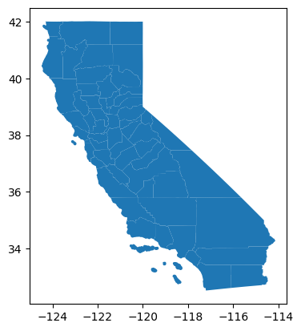

# PyTigris

_PyTigris__ is a python package that allows users to directly download and use TIGER/Line shapefiles (<https://www.census.gov/geographies/mapping-files/time-series/geo/tiger-line-file.html>) from the US Census Bureau.  

It is inspired by the excellent [tigris](https://github.com/walkerke/tigris) package for R, by [Kyle Walker](https://github.com/walkerke).

To install the package: 

```
pip install pytigris
```

## Usage:
```py
import pytigris
counties = pytigris.get_counties(states = 'ca')
counties.plot()
```



__PyTigris__ functions return `GeoDataFrame` objects. The feature geometries for US Census data default to the coordinate reference system NAD 1983 (EPSG: 4269).

__Available datasets:__

Please note: cartographic boundary files in __tigris__ are not available for 2011 and 2012.  

| Function | Datasets available | Years available |
|------------------------------------------|------------------------------------------------|------------------------------|
| `get_states()` | TIGER/Line; cartographic (1:500k; 1:5m; 1:20m) | 1990, 2000, 2008-* |
| `get_counties()` | TIGER/Line; cartographic (1:500k; 1:5m; 1:20m) | 1990, 2000, 2008-* |
| `get_tracts()` | TIGER/Line; cartographic (1:500k) | 1990, 2000, 2008-* |
<!-- | `get_nation()` | cartographic (1:5m; 1:20m) | 2013-2021 |
| `get_divisions()` | cartographic (1:500k; 1:5m; 1:20m) | 2013-2021 |
| `get_regions()` | cartographic (1:500k; 1:5m; 1:20m) | 2013-2021 |
| `get_block_groups()` | TIGER/Line; cartographic (1:500k) | 1990, 2000, 2010-2021 |
| `get_blocks()` | TIGER/Line | 2000, 2010-2021 |
| `get_places()` | TIGER/Line; cartographic (1:500k) | 2011-2021 |
| `get_pumas()` | TIGER/Line; cartographic (1:500k) | 2012-2021 |
| `get_school_districts()` | TIGER/Line; cartographic | 2011-2021 |
| `get_zctas()` | TIGER/Line; cartographic (1:500k) | 2000, 2010, 2012-2021 |
| `get_congressional_districts()` | TIGER/Line; cartographic (1:500k; 1:5m; 1:20m) | 2011-2021 |
| `get_state_legislative_districts()` | TIGER/Line; cartographic (1:500k) | 2011-2021 |
| `get_voting_districts()` | TIGER/Line | 2012 |
| `get_area_water()` | TIGER/Line | 2011-2021 |
| `get_linear_water()` | TIGER/Line | 2011-2021 |
| `get_coastline` | TIGER/Line() | 2013-2021 |
| `get_core_based_statistical_areas()` | TIGER/Line; cartographic (1:500k; 1:5m; 1:20m) | 2011-2021 |
| `get_combined_statistical_areas()` | TIGER/Line; cartographic (1:500k; 1:5m; 1:20m) | 2011-2021 |
| `get_metro_divisions()` | TIGER/Line | 2011-2021 |
| `get_new_england()` | TIGER/Line; cartographic (1:500k) | 2011-2021 |
| `get_county_subdivisions()` | TIGER/Line; cartographic (1:500k) | 2010-2021 |
| `get_urban_areas()` | TIGER/Line; cartographic (1:500k) | 2012-2021 |
| `get_primary_roads()` | TIGER/Line | 2011-2021 |
| `get_primary_secondary_roads()` | TIGER/Line | 2011-2021 |
| `get_roads()` | TIGER/Line | 2011-2021 |
| `get_rails()` | TIGER/Line | 2011-2021 |
| `get_native_areas()` | TIGER/Line; cartographic (1:500k) | 2011-2021 |
| `get_alaska_native_regional_corporations()` | TIGER/Line; cartographic (1:500k) | 2011-2021 |
| `get_tribal_block_groups()` | TIGER/Line | 2011-2021 |
| `get_tribal_census_tracts()` | TIGER/Line | 2011-2021 |
| `get_tribal_subdivisions_national()` | TIGER/Line | 2011-2021 |
| `get_landmarks()` | TIGER/Line | 2011-2021 |
| `get_military()` | TIGER/Line | 2011-2021 | -->
